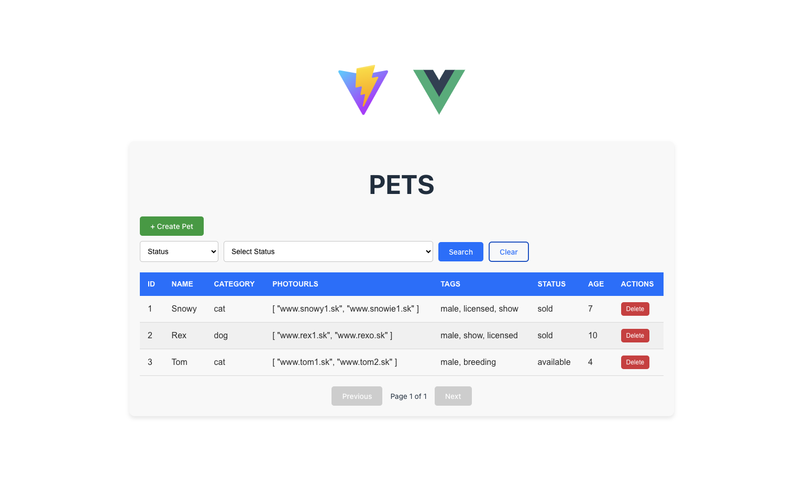

Pet Store Project
=================

Management of Pets

### Index of Pets


To see gallery of main features, open following folder:
`/demo`

Requirements
------------

Project is standalone app based on Nette framework.
* Backend functionality is provided by REST API, built on php 8.1 and Nette 3.2
* Frontend functionality is handled by Vue.js.

REST API postman collection is available in directory `/.tools/postman`

Pets data are stored in XML file that serves as database.
Example of this file is committed in folder `/data/database-example.xml`

Installation
------------

```
docker compose up -d
```

Then, open in browser:
`http://localhost:5173/`

This is homepage of Pet Store app, feel free to manage Pets.

How to extend Pet app
------------

How to add attribute to Pet:

1. Modify Denormalization & Validation
- PetSchemaNormalizer class handles denormalization & validation of PetRequest
2. Modify PetRequest class
- This value object represents change request for Pet entity. Promotes integrity within domain layer (business logic of app).
3. Fix UnitTests
- Domain integrity has changed, time to update tests to account for that.

Here is the example of commit that added age attribute to the pet:

`https://github.com/marhusar/pet-store/commit/4a3f637bd08da5cd5359ca76e08db1155f2ed6d9`

There is nothing to do on frontend side, because PetSchemaNormalizer provides schema for frontend components through REST API.

Tests
------------

Project provides tests container, that can execute unit tests and generate coverage.
Use following command to achieve both:
```
vendor/bin/phpunit --coverage-html tests/coverage/html
```

Key decisions
------------

- This whole app is scalable, therefore solution could be easily replaced with better one without breaking rest of the application.
- With this approach, if one solution is not sufficient, better one could be implemented.
- Why is it that not always the most bulletproof solution was not implemented? Because of the time required for implementation, this solution tried to achieve primary objectives first.

1. Why monolith/standalone app?

- This project should demonstrate use of Nette framework, REST API and ability to separate frontend & backend technology.
- REST api creates this separation between backend and frontend. Allowing us to split this app easily to 2 microservices: 1. Backend microservice with REST API 2. Frontend App
- This is the standard I would also recommend - use Rest API microservice to handle backend operation, and Frontend APP in Vue.js to handle UI.

2. Why store Pet data in XML file?

- This was required by project specification. I would prefer to use some type of SQL database. Use of ORM makes development much faster.
- I had used interfaces that allow us easily replace XML or InMemory repositories with ORM repositories if requirements would change.

3. Why Tags, Categories, Statuses are stored InMemory (in configuration)?

- These related entities are not directly managed by Pet store app and they will not change that often, some of them are just enums. For now, they are stored in configuration, where is easy to manage them.
- This "in configuration" implementation meets same standards as they would be saved in database, therefore it is easy to move them to the database - we just need implement ORM repositories for those entities.

4. Why there are ID references to the tags, categories, statuses in xml database?

- Those are related entities, if they are not stored through ID and name for category is actually changed, we would need to alter all pet records. In this case, we only store reference ID.
- If category name is changed, it is changed for all Pets at once after config update.

5. XML database is only storing references IDs to Tags, Statuses, Categories. How to eager load entities to the response?
- Decorator pattern was applied to repository, we can choose in flexible manner if we want to eager load all entities.

6. How is domain layer structured?

- Every request has to go through transport layer (Presenter) to domain layer (Saver/Provider - those are facade pattern implementations) to repository layer (xml or InMemory - configuration)
- To maintain integrity of domain layer (to avoid bugs caused by loose contracts), data are passed through domain layer with value objects. In this case PetRequest servers this purpose.
- This value object creates strict contract, therefore there is no more bugs in domain layer caused by loose contracts
- There is 1 disadvantage to this approach - when we want to pass another data, value object needs to be modified
- PetRequest object is created by denormalization after validation of data.

7. Is it possible to create REST API in more flexible manner? That would require only config that is possible to change easily?
- It is. All we need is ORM and all required API calls have to be fully restful.
- In that case only validation would need to change. Denormalization is dynamic, integrity of domain layer is handled with general value object.
- I had already implemented this solution in the past, could serve REST API in matter of minutes, required only configuration of validation.

8. Why to use contracts (interfaces) in Domain layer?
- promotes flexibility
- separates low level code, 3rd party dependencies from domain layer
- creates seams that allow us to Unit test whole domain layer

9. Why use Collection objects instead of arrays?
- improves readability
- array operations are often hard to read, so those operations are encapsulated

10. Why keep Transport layer (Presenters) thin?
- So we can unit test all business logic
- Easily switch frameworks if needed, business logic is framework independent
- This is achieved with use of facade pattern

11. Why to use Vue.js on frontend?
- use of components in Vue promotes flexibility
- promotes use of API, separates backend and frontend concerns easily
- I am aware that components used in frontend part of application should be split(more single responsible)
- I was focused primary on backend part of application as that was also the requirement

12. Why to use Docker?
- So it is easy to start application & manage dependencies

13. Why to unit test the app?
- to confirm integrity of domain layer
